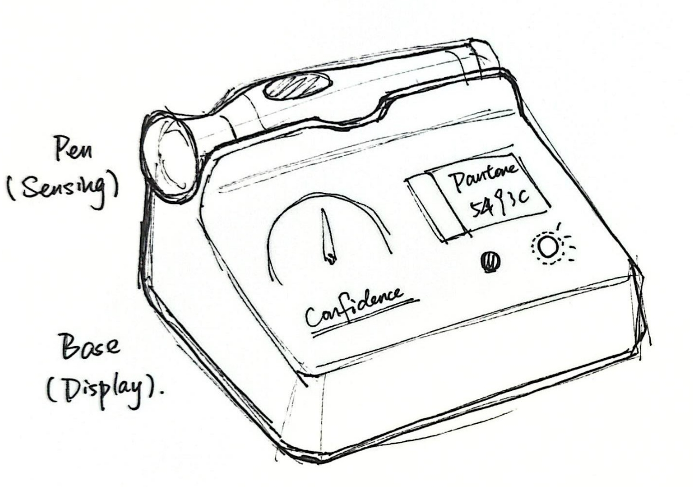
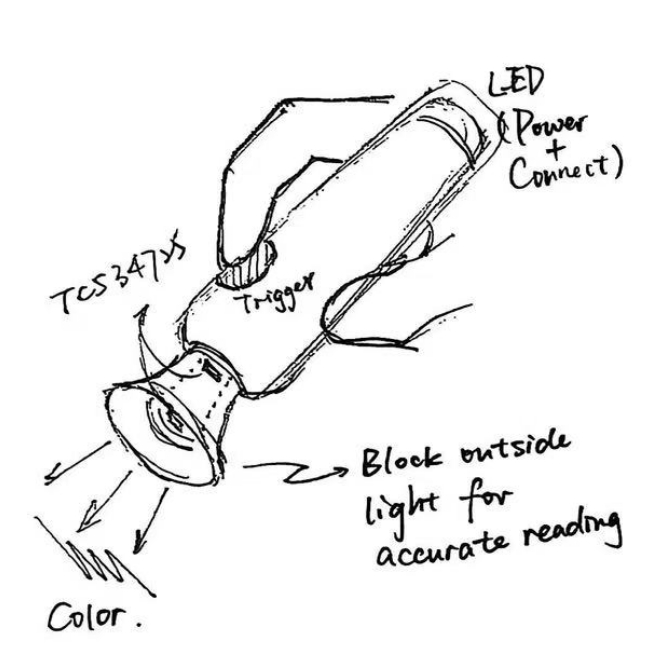
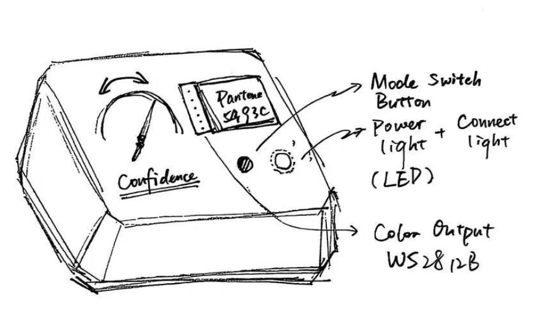
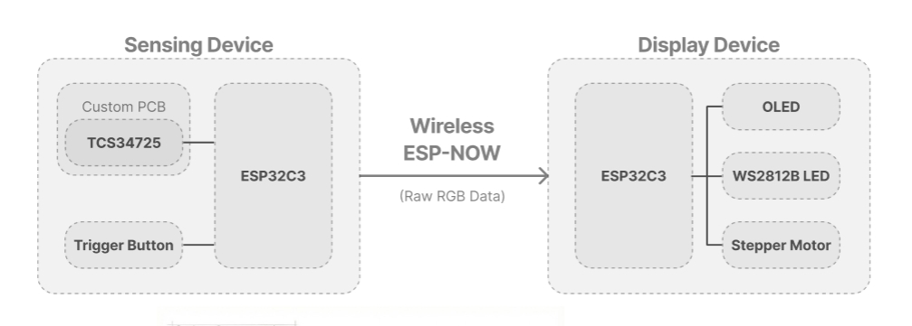
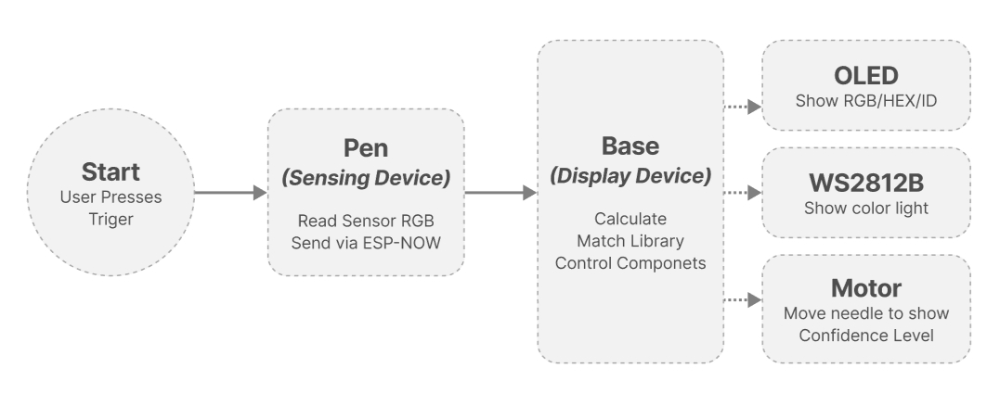
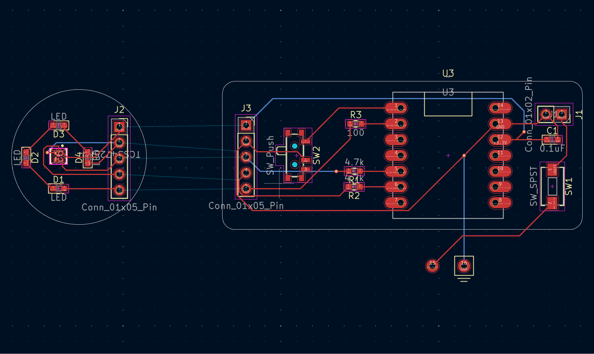
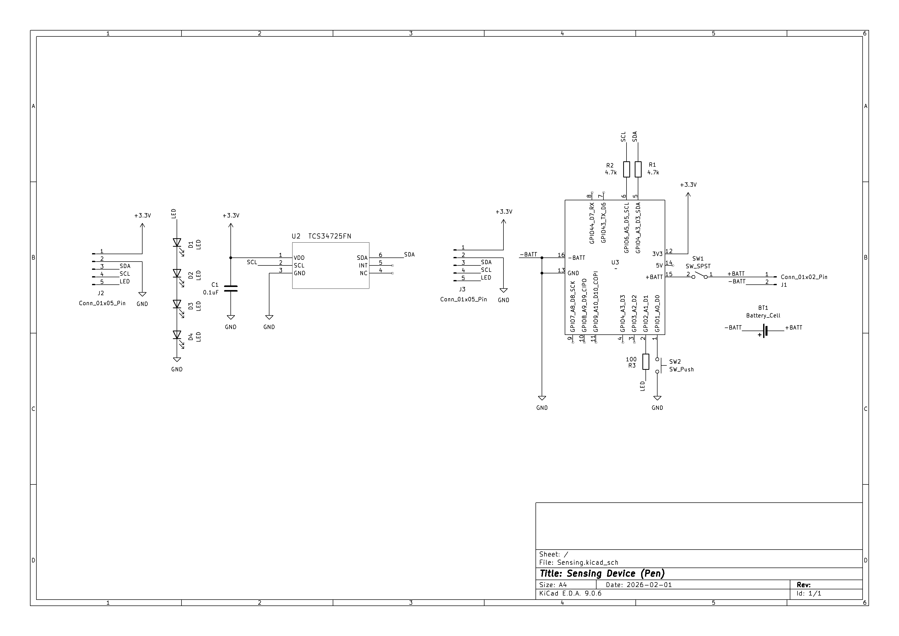
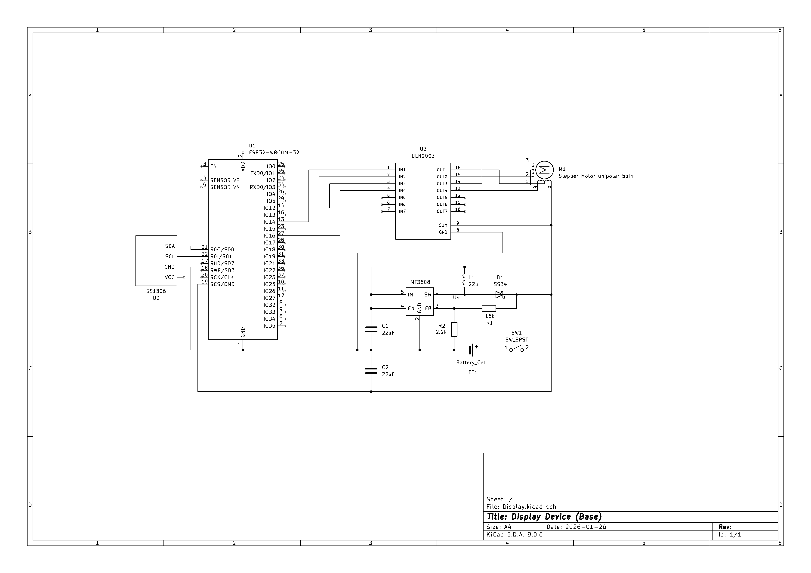

# TECHIN-514-Project : The Reality Color Dropper

## 1. Project Overview

**What it does:**
This project brings the digital "eyedropper" tool into real life. It consists of a pen-shaped device that scans the color of physical objects and a desktop station that displays the color data and the confidence level of the match. It helps designers capture colors from the real world instantly.

---

## 2. The Sensor Device (The Pen)

**Description:**
This is a handheld tool shaped like a marker pen. It utilizes a custom split-PCB architecture to fit the slim form factor. When the user finds a color, they press the button; the device reads the RGB value while blocking outside light and sends the data wirelessly to the base station.

**Key Components & Part Numbers:**

* **Controller: Seeed Studio XIAO ESP32C3**
    This thumb-sized microcontroller is selected for its compact footprint and built-in ESP-NOW capabilities. It fits perfectly inside the pen shaft.

* **Sensor Architecture: Split Custom PCB**
    To accommodate the pen's geometry, the circuit is split into two boards connected by a **1x5 Pin Header**:
    1.  **Motherboard (Main):** Vertically mounted inside the pen. Houses the MCU, battery pads, and switch.
    2.  **Daughterboard (Tip):** A circular PCB mounted horizontally at the tip. Houses the **TCS34725 Sensor** and **LEDs** to ensure the sensor faces the paper perpendicularly.

* **Input: Tactile Button**
    Acts as a "shutter" trigger.

* **Power: Li-Po Battery (402030 size)**
    A cylindrical/prismatic lithium battery that connects to the motherboard via a **1x2 Direct Solder Pad/Header**.

* **Power Switch: Slide Switch**
    A side-mounted switch to cut off power completely.

---

## 3. The Display Device (The Base)

**Description:**
This is a desktop base that receives the color data. It features an OLED screen for data readout, a stepper motor gauge for visual feedback on accuracy, and a large LED for color reproduction.

**Key Components & Part Numbers:**

* **Controller: Seeed Studio XIAO ESP32C3**
    The base station uses the exact same controller as the pen. This unified architecture simplifies the codebase and BOM.

* **Display: 0.96" OLED Screen (SSD1306 Driver)**
    Displays the Hex/RGB codes via I2C interface.

* **Color Output: WS2812B RGB LED**
    A programmable NeoPixel LED to visually visually recreate the scanned color.

* **Motor: 28BYJ-48 Stepper Motor & ULN2003 Driver**
    Indicates the "Confidence Level" (Euclidean distance) of the color match. The ULN2003 driver handles the high current required by the motor.

* **Power: 18650 Li-Ion Battery & MT3608 Boost Converter**
    Provides long-lasting power, boosted to 5V for the motor and LEDs.

---

## 4. System Logic & Communication

**Communication Method:**
The devices talk to each other using **ESP-NOW**.
* It is a peer-to-peer protocol (low latency).
* It does not require a router or Wi-Fi pairing.

**Workflow:**

1.  **Trigger:** User clicks the pen button.
2.  **Sensing:** The TCS34725 sensor (on the Daughterboard) reads the Raw RGB data.
3.  **Sending:** The Pen (XIAO ESP32C3) processes the data and sends it via ESP-NOW.
4.  **Receiving:** The Base (XIAO ESP32C3) receives the packet.
5.  **Processing (DSP/ML):** The Base calculates the **Euclidean Distance** between the scanned color and a stored color library (KNN algorithm).
6.  **Output:**
    * The **OLED** shows the color code.
    * The **WS2812B LED** lights up in that color.
    * The **Stepper Motor** moves the needle to show the confidence level.

---

# Electrical Schematics & PCB Layout

## Custom PCB Design
The pen utilizes a custom **Split-PCB Design** to manage the directional requirements of the sensor.

The split-PCB architecture is implemented to allow the sensor to sit perpendicular to the scanning surface for accurate readings, while the main controller fits vertically within the narrow pen shaft.

* **Connection:** The Main Board and Sensor Tip are linked via a flexible **1x5 Connector** carrying 3.3V, GND, SDA, SCL, and LED Control.
* **Power:** The battery connects to the tail of the Main Board via a **1x2 Connector**.

### **Custom PCB Screenshots**

## Circuit Schematics

### **Sensing Device Schematic**

### **Display Device Schematic**

---

# BOM

- [Sensing BOM](./schematics/Sensing/Sensing.csv)
- [Display BOM](./schematics/Display/Display.csv)